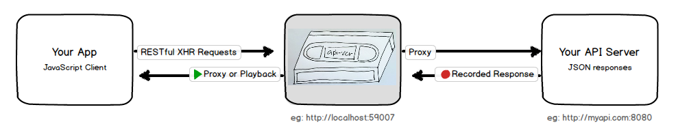
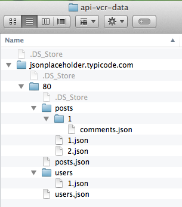

# Record and Play Back your API

 
> Drawing credit: [dancingpirates](https://instagram.com/dancingpirates/)

This records API responses so you can play them back later, quickly and reliably.

If you're a front-end developer this means you can develop without an API server--even without the internet.

You can also write tests for front end components that have some API dependencies but shouldn't break if the API server has hiccups.

This is a node app with no database dependency. It's easy to integrate with `grunt` or `gulp`, or use from the command line.

It's good for:

* **Testing** (Responses are always the same, and fast)
* **Nomads** (Work on JS apps without internet)
* **Unstable APIs** (the VCR smooths out API downtimes)
* **Throttled APIs** (don't get shut down for querying too much while developing)
* **Coordinating** with frequent back end changes that require 30 minutes of API downtime to rebuild and deploy (ahem).

## How it Works

This works by standing up a server in between your app and your API. If you have control over your app's API url, it's easy--just point it to `api-vcr` instead.

If you have multiple API servers, no problem. You stand up an instance of the vcr for each one. Each VCR will have a different port so you set them up as different urls in your app, just like you're probably already doing.

If you do not have control over the API server being requested (if you're using library code, for example), you can modify your `etc/hosts` file to accomplish the same flow. I'm thinking about a script to make this easier, but I have some security concerns and I'm not sure about the design. I don't want to mess up anybody's system.

Whenever you make reqeuests to api-vcr in `--record` mode, it passes the request on to your destination api server and records the response. You can see JSON files for your recorded responses in finder any time:

## Precedent

This is similar to [some](https://github.com/vcr/vcr) [other](http://www.mock-server.com/) [projects](https://github.com/assaf/node-replay).
Other projects might be better for your needs, but some things make this one different:

* Other solutions are focused on testing. That's great and valid, but I want to **develop** against something fast, deterministic, and reliable, too.
* This is written in Node, so it's easy to fit in with a front end developer's workflow.
* I store the responses as plain text JSON files so you can modify them whenever you want, and see very clearly where I create bugs or mismatch your expectations on API paths.
* You can fake out your own API by making a tree of `json` files. No recording necessary. That could be pretty useful, huh?
* Supports multiple API servers. You just run multiple instances and it stores data in a folder tree by hostname and port.

## Installation

This module is a dev tool with a command line interface, so it is installed globally.

    npm install -g api-vcr

I'd actually prefer it to be local to a project, but there's no way to provide a nice CLI API in a locally installed node module.
You'd have to type `./node_modules/.bin/api-vcr` all the time (plus args), and I don't want to do that to you.
This is actually why [grunt-cli](https://github.com/gruntjs/grunt-cli) exists, I now understand.

## Quick Start Guide

First let's launch in `--record` mode so we can pass through requests and record the responses:

    api-vcr http://jsonplaceholder.typicode.com/ --record

Now lets hit some endpoints so we can get a nice set of data.

In a browser, you can drop in these urls, or any from the [jsonplaceholder api](http://jsonplaceholder.typicode.com/):

* [http://localhost:59007/users](http://localhost:59007/users)
* [http://localhost:59007/users/1](http://localhost:59007/users/1)
* [http://localhost:59007/posts/2](http://localhost:59007/posts/2)
* [http://localhost:59007/posts/1/comments](http://localhost:59007/posts/1/comments)

For each request, the VCR will create a single JSON file, using the request information to name the file.

For example, the request:

    GET http://localhost:59007/users/1

Is mapped to the file:

    ./api-vcr-data/jsonplaceholder.typicode.com/80/users/1.json

After recording a little, you can stop the server with `Ctrl+C`. Armed with recorded data, you're ready to run in offline playback mode.

    api-vcr http://jsonplaceholder.typicode.com

Now any request you've previously recorded returns instantly and reliably from disk:

* [http://localhost:59007/users](http://localhost:59007/users)
* [http://localhost:59007/users/1](http://localhost:59007/users/1)

Similar requests you haven't recorded yet return their best guess:

* [http://localhost:59007/users/9999](http://localhost:59007/users/9999)

Totally new requests return a 404:

* [http://localhost:59007/the/rain/in/spain](http://localhost:59007/the/rain/in/spain)

## Options

### `--port`

    api-vcr http://myapi.com:8080 --port=1337

You can specify a port for the vcr server to listen on.
This is useful for running more than once instance.
The port of the API server is used by default (unless that port is 80),
this makes keeping proxies straight a little easier if you have remote APIs identified only by port number.

### `--data`

    api-vcr http://myapi.com:8080 --data=~/sites/myApp/testData

By default, data is stored wherever you run the command. If you always run the command from your project dir, this works well. You can also set a hard-coded data path.

### `--noSiblings`

    api-vcr http://myapi.com:8080 --noSiblings

By default the vcr looks for a sibling if it can't find a requested object. If you ask for `user/7`, for example, it will return `user/42` if it has one.
This is awesome if you just want to keep working and it doesn't matter too much that it's the wrong user/product/sprocket/whatever.

Not everyone wants this behavior though, so this option lets you turn it off.

## Seeding data

Data is all in the `./api-vcr-data` folder local to where you run the command, or where you configure it with the `--data` option. If you run this as a build task inside your project this works well--your api data is stored with your project.

You can create or modify data at will and distribute it in git with your project for consistent testing and front-end development across machines.

Please be aware that if you run in record mode, it will overwrite any file with the same name, so if you make extensive manual edits to the data you should protect them.

## Developing

Running the local version is the same except instead of `api-vcr`, you use `./cli.js` from this folder.

You can bump the version with npm's awesome `npm version patch && npm publish`.

## TODO

- [x] Start the app a `record` option
- [x] Logs all requests to console
- [x] Pass requests on to the recorded server
- [x] Create a directory structure that matches requests (namespace by server and port to support multiple APIs)
- [x] Store request responses as JSON files
- [x] Support missing objects (eg: if you have recorded `surfboard/3` and they request `5`, return `3` instead)
- [x] Print version on startup
- [x] Switch to a global install for easier run API by packages that depend on this one.
- [x] Bug: encode colons to `%3A` or something else in filenames

- [ ] Bug: returning similar siblings returns deep nested JSON if there is a child folder (eg: posts/777 returns posts/1/comments.json)
- [ ] Bug: returning siblings shouldn't return list objects for id requests and visa-versa
- [ ] Handle non JSON gracefully
- [ ] Screenshot of requests, mapping to screenshot of files in finder
- [ ] Script to add and remove from etc/hosts. (design? will this work?)
- [ ] Chrome extension difficulty estimation. https://github.com/chrisaljoudi/uBlock. Dev tools tab, monitor xhr and check boxes for ones to record?
- [ ] Support a config file, maybe in `./api-vcr-config.json` (is there an option parsing library that supports fall-through from args to json file to defaults?)
- [ ] Print the fully resolved path name for data, otherwise it's unclear where `.` is
- [ ] Have a simple index page with list of all routes we know about, for easy debugging/transparency
- [ ] Support query params
- [ ] Option to trim large array responses to 20-100 max (default true)
- [ ] Support response types other than JSON gracefully
- [ ] Support POST, PUT, DELETE (at least don't error, and return a sensible object)